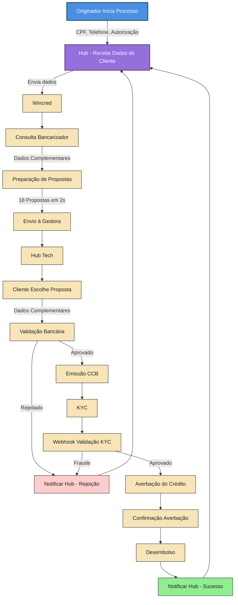

## Contexto

Fluxo onde o **originador** entra em contato com o cliente e realiza a venda do crédito.

---

## Fluxo Visual

```mermaid
graph TD
    Start[Originador Inicia Processo] -->|CPF, Telefone, Autorização| Hub[Hub - Recebe Dados do Cliente]
    Hub -->|Envia dados| B[Wincred]
    B --> C[Consulta Bancarizador]
    C -->|Dados Complementares| D[Preparação de Propostas]
    D -->|18 Propostas em 2s| E[Envio à Gestora]
    E --> F[Hub Tech]
    F --> G[Cliente Escolhe Proposta]
    G -->|Dados Complementares| H[Validação Bancária]
    H -->|Aprovado| I[Emissão CCB]
    H -->|Rejeitado| Z[Notificar Hub - Rejeição]
    I --> J[KYC]
    J --> K[Webhook Validação KYC]
    K -->|Aprovado| L[Averbação do Crédito]
    K -->|Fraude| Z
    L --> M[Confirmação Averbação]
    M --> N[Desembolso]
    N --> O[Notificar Hub - Sucesso]
    Z --> Hub
    O --> Hub

    style Start fill:#4a90e2,color:#ffffff,stroke:#2e5c8a,stroke-width:3px
    style Hub fill:#9370db,color:#ffffff,stroke:#5a3d8a,stroke-width:2px
    style B fill:#f9e4b7,color:#122621,stroke:#122621
    style C fill:#f9e4b7,color:#122621,stroke:#122621
    style D fill:#f9e4b7,color:#122621,stroke:#122621
    style E fill:#f9e4b7,color:#122621,stroke:#122621
    style F fill:#f9e4b7,color:#122621,stroke:#122621
    style G fill:#f9e4b7,color:#122621,stroke:#122621
    style H fill:#f9e4b7,color:#122621,stroke:#122621
    style I fill:#f9e4b7,color:#122621,stroke:#122621
    style J fill:#f9e4b7,color:#122621,stroke:#122621
    style K fill:#f9e4b7,color:#122621,stroke:#122621
    style L fill:#f9e4b7,color:#122621,stroke:#122621
    style M fill:#f9e4b7,color:#122621,stroke:#122621
    style N fill:#f9e4b7,color:#122621,stroke:#122621
    style O fill:#90ee90,color:#122621,stroke:#122621
    style Z fill:#ffcccc,color:#122621,stroke:#122621

```

---
