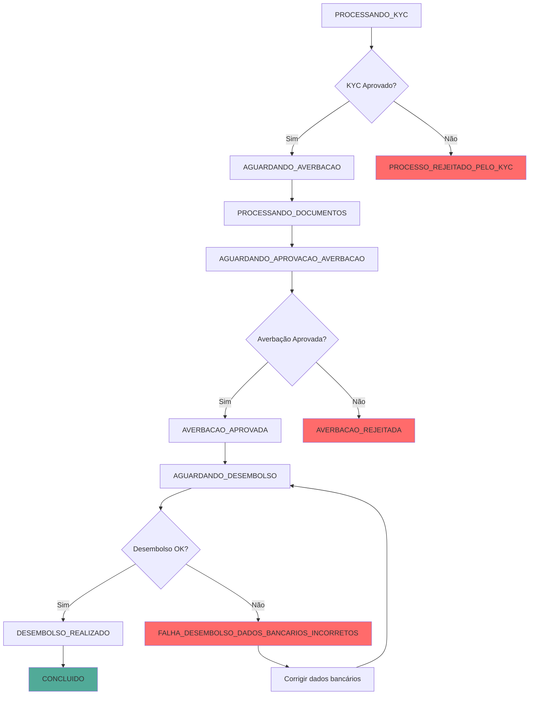

## Visão Geral

Quando uma proposta de crédito consignado é enviada para aprovação, a Wincred processa a solicitação e envia eventos em tempo real para o webhook configurado, informando sobre o progresso e resultado da contratação.

Este webhook notifica sobre todas as etapas do ciclo de vida do contrato, desde a análise de KYC até a conclusão do desembolso.

## Estrutura do Evento
```json
{
  "idContrato": "123e4567-e89b-12d3-a456-426614174000",
  "evento": "v1.e-consignado.contratacao-ativa.contratos",
  "status": "PROCESSANDO_KYC",
  "dataCriacao": "2024-06-10T14:30:00Z"
}
```

### Parâmetros

<ParamField path="idContrato" type="UUID" required>
  Identificador único do contrato no formato UUID
</ParamField>

<ParamField path="evento" type="string" required>
  Tipo do evento. Valor fixo: `v1.e-consignado.contratacao-ativa.contratos`
</ParamField>

<ParamField path="status" type="string" required>
  Status atual do contrato. Veja a lista completa de status abaixo
</ParamField>

<ParamField path="dataCriacao" type="string" required>
  Data e hora da criação do evento no formato ISO 8601 (UTC)
</ParamField>

## Status do Contrato


<AccordionGroup>
  <Accordion title="PROCESSANDO_KYC">
    O contrato está em análise de Know Your Customer (KYC). Nesta etapa, são verificadas informações cadastrais, documentação e elegibilidade do cliente.
    
    **Próximos status possíveis:**
    - `AGUARDANDO_AVERBACAO` (aprovado no KYC)
    - `PROCESSO_REJEITADO_PELO_KYC` (reprovado no KYC)
  </Accordion>

  <Accordion title="PROCESSO_REJEITADO_PELO_KYC">
    A proposta foi rejeitada durante a análise de KYC. O contrato não prosseguirá.
    
    **Status final:** Este é um status terminal. Consulte os detalhes do contrato para entender o motivo da rejeição.
  </Accordion>

  <Accordion title="AGUARDANDO_AVERBACAO">
    O contrato foi aprovado no KYC e está aguardando o processo de averbação junto ao órgão/instituição pagadora.
    
    **Próximos status possíveis:**
    - `PROCESSANDO_DOCUMENTOS`
    - `AGUARDANDO_APROVACAO_AVERBACAO`
  </Accordion>

  <Accordion title="PROCESSANDO_DOCUMENTOS">
    Os documentos contratuais estão sendo processados e validados.
    
    **Próximos status possíveis:**
    - `AGUARDANDO_APROVACAO_AVERBACAO`
  </Accordion>

  <Accordion title="AGUARDANDO_APROVACAO_AVERBACAO">
    A averbação foi solicitada e está aguardando aprovação do órgão/instituição pagadora.
    
    **Próximos status possíveis:**
    - `AVERBACAO_APROVADA`
    - `AVERBACAO_REJEITADA`
  </Accordion>
</AccordionGroup>

<AccordionGroup>
  <Accordion title="AVERBACAO_APROVADA">
    A averbação foi aprovada pelo órgão/instituição pagadora. O contrato está pronto para desembolso.
    
    **Próximos status possíveis:**
    - `AGUARDANDO_DESEMBOLSO`
  </Accordion>

  <Accordion title="AVERBACAO_REJEITADA">
    A averbação foi rejeitada pelo órgão/instituição pagadora. O contrato não prosseguirá.
    
    **Status final:** Este é um status terminal. Consulte os detalhes do contrato para entender o motivo da rejeição.
  </Accordion>
</AccordionGroup>

<AccordionGroup>
  <Accordion title="AGUARDANDO_DESEMBOLSO">
    O contrato está aguardando o processamento do desembolso para a conta do cliente.
    
    **Próximos status possíveis:**
    - `DESEMBOLSO_REALIZADO`
    - `FALHA_DESEMBOLSO_DADOS_BANCARIOS_INCORRETOS`
  </Accordion>

  <Accordion title="FALHA_DESEMBOLSO_DADOS_BANCARIOS_INCORRETOS">
    Houve uma falha no desembolso devido a dados bancários incorretos ou inválidos.
    
    **Ação necessária:** Atualize os dados bancários do cliente e o desembolso será reprocessado automaticamente.
  </Accordion>

  <Accordion title="DESEMBOLSO_REALIZADO">
    O desembolso foi realizado com sucesso na conta do cliente.
    
    **Próximos status possíveis:**
    - `CONCLUIDO`
  </Accordion>
</AccordionGroup>

<AccordionGroup>
  <Accordion title="CONCLUIDO">
    O contrato foi concluído com sucesso. Todas as etapas foram finalizadas.
    
    **Status final:** Este é o status de sucesso da jornada completa do contrato.
  </Accordion>
</AccordionGroup>

## Fluxo de Estados


## Exemplos de Payloads

<CodeGroup>
```json Início do Processo
{
  "idContrato": "123e4567-e89b-12d3-a456-426614174000",
  "evento": "v1.e-consignado.contratacao-ativa.contratos",
  "status": "PROCESSANDO_KYC",
  "dataCriacao": "2024-06-10T14:30:00Z"
}
```
```json Aprovação de Averbação
{
  "idContrato": "123e4567-e89b-12d3-a456-426614174000",
  "evento": "v1.e-consignado.contratacao-ativa.contratos",
  "status": "AVERBACAO_APROVADA",
  "dataCriacao": "2024-06-10T16:45:00Z"
}
```
```json Desembolso Realizado
{
  "idContrato": "123e4567-e89b-12d3-a456-426614174000",
  "evento": "v1.e-consignado.contratacao-ativa.contratos",
  "status": "DESEMBOLSO_REALIZADO",
  "dataCriacao": "2024-06-10T18:20:00Z"
}
```
```json Contrato Concluído
{
  "idContrato": "123e4567-e89b-12d3-a456-426614174000",
  "evento": "v1.e-consignado.contratacao-ativa.contratos",
  "status": "CONCLUIDO",
  "dataCriacao": "2024-06-10T18:25:00Z"
}
```
```json Rejeição no KYC
{
  "idContrato": "123e4567-e89b-12d3-a456-426614174000",
  "evento": "v1.e-consignado.contratacao-ativa.contratos",
  "status": "PROCESSO_REJEITADO_PELO_KYC",
  "dataCriacao": "2024-06-10T15:00:00Z"
}
```
```json Falha no Desembolso
{
  "idContrato": "123e4567-e89b-12d3-a456-426614174000",
  "evento": "v1.e-consignado.contratacao-ativa.contratos",
  "status": "FALHA_DESEMBOLSO_DADOS_BANCARIOS_INCORRETOS",
  "dataCriacao": "2024-06-10T18:15:00Z"
}
```

</CodeGroup>


## Status Finais

Os seguintes status indicam que o contrato chegou ao fim de sua jornada:

| Status | Resultado | Descrição |
|--------|-----------|-----------|
| `CONCLUIDO` | ✅ Sucesso | Contrato concluído com sucesso |
| `PROCESSO_REJEITADO_PELO_KYC` | ❌ Rejeição | Reprovado na análise de KYC |
| `AVERBACAO_REJEITADA` | ❌ Rejeição | Averbação rejeitada pelo órgão pagador |

<Note>
  Para status de falha como `FALHA_DESEMBOLSO_DADOS_BANCARIOS_INCORRETOS`, o contrato pode retornar ao fluxo após correção dos dados.
</Note>
